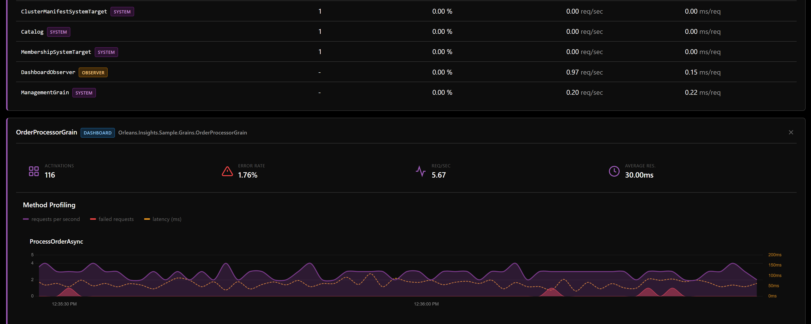
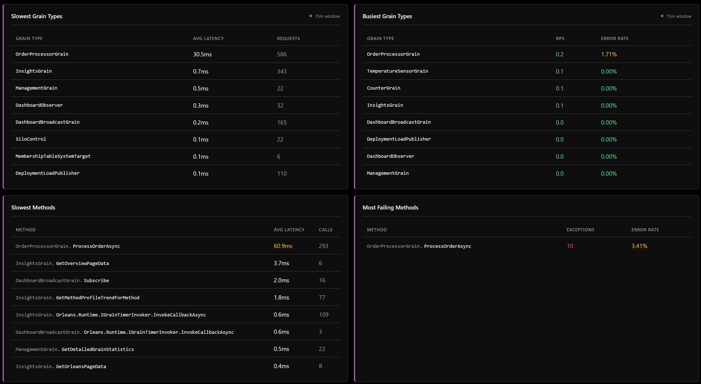

# Orleans.Insights

A modern, high-performance dashboard for Microsoft Orleans with DuckDB-powered time-series analytics.


*Real-time method profiling with latency, throughput, and error tracking*

## Features

- **Real-time monitoring** - SignalR-based push updates for live cluster visibility
- **DuckDB analytics** - In-memory time-series database for historical queries and trend analysis
- **Accurate method profiling** - True average calculations (not average of averages)
- **Anomaly detection** - Automatic detection of latency and error rate anomalies
- **Modern UI** - Blazor WebAssembly dashboard with responsive design
- **Trend analysis** - Historical trends for grains, methods, and cluster metrics

## Comparison with OrleansDashboard

| Feature | Orleans.Insights | OrleansDashboard |
|---------|-----------------|------------------|
| Storage | DuckDB (time-series) | In-memory only |
| Historical queries | Full SQL analytics | None |
| Method profiling | Accurate totals | Average of averages |
| Real-time updates | SignalR push | Polling |
| UI Framework | Blazor WASM | jQuery/Razor |
| Anomaly detection | Built-in | None |
| Trend analysis | Built-in | None |

## Installation

### NuGet Packages

```bash
dotnet add package Orleans.Insights
dotnet add package Orleans.Insights.Dashboard
```

### Silo Configuration

```csharp
var builder = Host.CreateApplicationBuilder(args);

builder.UseOrleans(siloBuilder =>
{
    siloBuilder
        .UseLocalhostClustering()
        .AddOrleansInsights(options =>
        {
            options.RetentionPeriod = TimeSpan.FromHours(24);
            options.BroadcastInterval = TimeSpan.FromSeconds(1);
        });
});
```

### Web Host Configuration

```csharp
var builder = WebApplication.CreateBuilder(args);

// Add dashboard services
builder.Services.AddOrleansInsightsDashboard();

var app = builder.Build();

// Map dashboard endpoints
app.MapOrleansInsightsDashboard("/dashboard");

app.Run();
```

## Architecture

```
Silos (Metrics Collection)
    │
    ▼
InsightsGrain (Singleton)
    │ ├── Channel-based buffer (non-blocking ingestion)
    │ ├── DuckDB (time-series storage with MVCC)
    │ ├── Three-tier background refresh (fast/slow/broadcast)
    │ └── Change detection with observer notifications
    ▼
DashboardBroadcastGrain (per-silo singleton)
    │ ├── Orleans IGrainObserver pattern
    │ ├── ObserverManager for subscription tracking
    │ └── Circuit breaker for fault tolerance
    ▼
SignalR Hub ←→ IDashboardObserver
    │
    ▼
Blazor WASM Dashboard
```

## Performance Design

Orleans.Insights is designed to minimize impact on your Orleans cluster:

### Non-Blocking Ingestion
Metrics are ingested via a lock-free `Channel<T>` with `BoundedChannelFullMode.DropOldest`. Producers never block - if the channel is full, the oldest metrics are dropped rather than causing backpressure. This ensures grain method calls are never delayed by metrics collection.

### Dedicated Consumer Thread
A single persistent consumer runs on a dedicated `LongRunning` thread, completely isolated from the Orleans thread pool. This eliminates any risk of thread pool starvation. The consumer uses `WaitToReadAsync` for efficient signaling - the thread is released when idle and resumed when items arrive.

### MVCC Reads
DuckDB connections are duplicated via `Duplicate()` for read operations, enabling true MVCC (Multi-Version Concurrency Control). Dashboard queries use their own connection while writes continue uninterrupted on the main connection.

### Bounded Memory Growth
In-memory aggregations use LRU eviction with configurable limits (`MaxMetricsEntries`). This prevents unbounded memory growth in long-running silos with many grain types.

### Three-Tier Background Processing
Dashboard data is pre-built by background refresh loops using `PeriodicTimer` for precise timing:
- **Fast refresh** (1s): Overview and Orleans pages run in parallel on thread pool
- **Slow refresh** (5s): Insights page with trend analysis
- **Broadcast timer** (grain timer): O(1) volatile reads from pre-built cache, pushes only on data change

This architecture ensures the grain scheduler is never blocked by expensive DuckDB queries.

### Observer Pattern with Circuit Breaker
Real-time updates use Orleans `IGrainObserver` for push-based notifications:
- `ObserverManager` tracks subscriptions with automatic expiration
- `ObserverHealthTracker` implements circuit breaker for fault tolerance
- Grace period buffering prevents message loss during transient disconnects
- Cached delegates eliminate lambda allocations on every broadcast

## Projects

### Orleans.Insights

Core library that provides metrics collection and storage. Install this on every silo in your cluster.

**Key Components:**
- **GrainMethodProfiler** - Intercepts grain method calls to collect latency, throughput, and error metrics
- **SiloMetricsCollector** - Collects silo-level metrics (CPU, memory, activation counts) using `Process` APIs and `IManagementGrain.GetDetailedGrainStatistics()`
- **InsightsGrain** - Singleton grain that aggregates metrics from all silos and stores them in DuckDB
- **InsightsDatabase** - DuckDB wrapper for time-series storage with automatic retention cleanup
- **GrainTypeNameCache** - Caches grain type names using `Type.FullName` for consistent identification

**Metrics Collected:**
- Per-method: call count, latency (avg/min/max), error count, requests per second
- Per-silo: CPU usage, memory usage, activation counts per grain type
- Per-grain-type: total activations across cluster, aggregated method metrics

### Orleans.Insights.Dashboard

Server-side dashboard components. Install this on the host that serves the dashboard UI.

**Key Components:**
- **DashboardHub** - SignalR hub for real-time push updates to connected clients
- **DashboardBroadcastGrain** - Per-silo singleton grain that broadcasts page data via Orleans observers
- **DashboardObserver** - `IGrainObserver` implementation bridging Orleans notifications to SignalR
- **ObserverHealthTracker** - Circuit breaker and health tracking for observer fault tolerance
- **DashboardExtensions** - Extension methods for `IServiceCollection` and `IEndpointRouteBuilder` configuration

**Responsibilities:**
- Serves the Blazor WebAssembly client static files
- Manages SignalR connections and observer subscriptions (one observer per connection)
- Routes page data from InsightsGrain → DashboardBroadcastGrain → Observer → SignalR → Client

### Orleans.Insights.Dashboard.Client

Blazor WebAssembly client application for the dashboard UI.

**Key Components:**
- **DashboardSignalRService** - SignalR client with heartbeat to keep observer subscriptions alive
- **Dashboard Pages:**
  - **Overview** - Cluster summary with silo status cards
  - **Orleans** - Grain type list with method profiling charts
  - **Insights** - Slowest/busiest grains, trend analysis
  - **Settings** - Configuration and diagnostics

**UI Features:**
- Real-time updates via SignalR push (no polling)
- `PeriodicTimer`-based heartbeat to prevent observer expiration
- Interactive charts using a lightweight charting library
- Responsive grid layout for silo and grain cards

### Orleans.Insights.Sample

Sample application demonstrating Orleans.Insights integration.

**Contents:**
- Sample grains: `CounterGrain`, `TemperatureSensorGrain`, `OrderProcessorGrain`
- `GrainActivitySimulator` - Background service that generates grain traffic for demo purposes
- Serilog configuration for file-based logging

## Dashboard Pages

### Orleans Page
Detailed grain monitoring with interactive method profiling:


- Grain list with system/observer/dashboard badges for filtering
- Per-grain detail panel showing activations, error rate, RPS, and average latency
- Interactive method profiling chart with requests/sec, failed requests, and latency trends
- Per-silo breakdown for multi-silo clusters

### Insights Page
Trend analysis, anomaly detection, and performance comparisons:



- **Slowest Grain Types** - Top grains by average latency with request counts
- **Busiest Grain Types** - Top grains by requests per second with error rates
- **Slowest Methods** - Individual method latency analysis
- **Most Failing Methods** - Methods with highest exception counts and error rates

### Other Pages
- **Overview** - High-level cluster summary with silo status cards
- **Settings** - Configuration, diagnostics, and database statistics

## Configuration Options

```csharp
public class InsightsOptions
{
    // === Data Retention ===
    // How long to retain historical data (default: 1 hour)
    public TimeSpan RetentionPeriod { get; set; }

    // === Maintenance ===
    // How often to run maintenance tasks (default: 1 minute)
    public TimeSpan MaintenanceInterval { get; set; }

    // How often to run vacuum/checkpoint operations (default: 30 minutes)
    public TimeSpan VacuumInterval { get; set; }

    // How often to log database metrics (default: 5 minutes)
    public TimeSpan MetricsLogInterval { get; set; }

    // === Queries ===
    // Default duration for queries when not specified (default: 30 minutes)
    public TimeSpan DefaultQueryDuration { get; set; }

    // === DuckDB Buffering ===
    // Number of records to buffer before flushing to DuckDB (default: 1000)
    public int BatchFlushThreshold { get; set; }

    // Capacity of the bounded channel for metrics buffering (default: 10,000)
    // When full, oldest items are dropped (backpressure handling)
    public int ChannelCapacity { get; set; }
}
```

## Requirements

- .NET 10.0+
- Microsoft Orleans 10.0+
- DuckDB.NET 1.4+

## License

MIT License - See [LICENSE](LICENSE) for details.

## Contributing

Contributions are welcome! Please feel free to submit a Pull Request.
